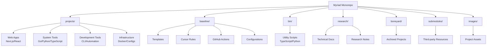
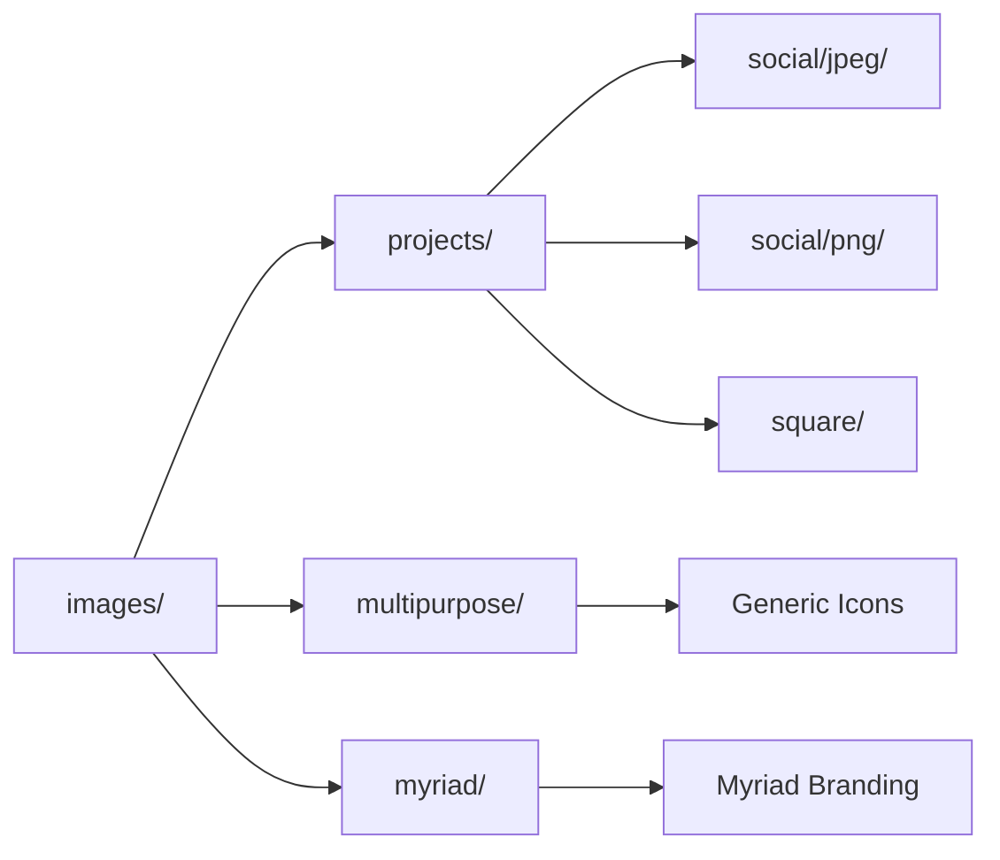

# CLAUDE.md - AI Agent Instructions

**TARGET AUDIENCE**: AI agents only. Humans use README.md.
**OPTIMIZATION**: Information density maximized, token usage minimized.

## 🚨 UNIVERSAL DEVELOPMENT RULES (MANDATORY)

These rules are REQUIRED for all repositories and override all other considerations.

### 1️⃣ **QUALITY OVER SPEED**
- Unlimited time for correct implementations
- Unlimited AI calls for research/verification
- Most robust solution, not quickest
- Ruthless refactoring when improvements spotted
- FORBIDDEN: "good enough", hacks, shortcuts, API call concerns

### 2️⃣ **MANDATORY TESTING**
- All logic/side effects MUST have tests
- NO EXCEPTIONS - function written = test written
- Cover edge cases and error conditions
- Tests must pass before commits
- TEST: API endpoints (backend), utility functions, auth/validation, database ops, error paths
- SKIP: trivial getters/setters, frontend components, pure config objects

### 3️⃣ **SYNCHRONIZED DOCUMENTATION**
After ANY significant change, update BOTH:
- `CLAUDE.md` - Technical reference for AI agents
- `README.md` - User-friendly guide
- TRIGGERS: API changes, features, architecture, auth, config, breaking changes

### 4️⃣ **QUALITY VERIFICATION WORKFLOW**
MANDATORY SEQUENCE:
1. PRIMARY: `bun run lint`, `bun run typecheck`, `bun run test`
2. FULL BUILD: `bun run check` (only after primary passes)
- Fix immediately if fails
- Add specific TODOs if must defer

### 5️⃣ **COMMIT HYGIENE**
- WHEN: after features/bugs/refactoring, before new work
- METHOD: `git add -A . && oco --fgm --yes` or `git add -A . && git commit -am "[emoji] [description]"`
- NEVER COMMIT: failing tests, TS errors, lint violations, broken builds

### 6️⃣ **ZERO TOLERANCE MOCK DATA**
- PRINCIPLE: Real service calls only, crash loudly on failure
- FORBIDDEN: Math.random(), hardcoded metrics, mock data, demo modes, fallback masking
- REQUIRED: Real service calls, explicit errors, proper HTTP codes, visible crashes
- EXCEPTION: Test files only

### 7️⃣ **NO INCOMPLETE IMPLEMENTATIONS**
- Nothing "for later" without explicit marking
- FORBIDDEN: Empty functions, generic errors, silent failures
- REQUIRED: `// TODO: [specific description]` for all incomplete work
- PRINCIPLE: Crash visibly vs fail silently

### 8️⃣ **PRE-PRODUCTION BREAKING CHANGES** (Active Until Production)
- Break freely to improve code quality
- FORBIDDEN: migrations, backwards compatibility
- REQUIRED: Document changes, list breakage, explain improvements

## 🏗️ MONOREPO ARCHITECTURE



## 🛠️ TECHNOLOGY STACK

**Primary**: Bun (1.2.15), TypeScript (5.8.3), Node.js (LTS)
**Languages**: TypeScript, Python (3.13.4), Go (1.24.3), Ruby (3.4.3)
**Tooling**: mise, Trunk, Biome, Claude Code
**Platforms**: Cloudflare Workers, Vercel, Docker

## 📁 REPOSITORY STRUCTURE

### `/projects/` - Active Development
**Web Applications**:
- `dnstool/` - Next.js DNS analysis (Cloudflare)
- `keycheck/` - Next.js security tool (Vercel)
- `ticket-explorer/` - React ticket management (synthwave UI)
- `movietool/` - Flask duplicate detection
- `neocities/` - Static site generation

**System Tools**:
- `aaisp-exporter/` - Go Prometheus exporter
- `netflow/` - Docker ntopng traffic analysis
- `envhunter/` - Ruby env discovery gem
- `lsr/` - Python security reconnaissance

**Development Tools**:
- `alt/` - Raycast AI alt-text extension
- `bump/` - TypeScript version bumping
- `mcp/` - Model Context Protocol processor
- `rails-template/` - Rails 8 application template

**Infrastructure**:
- `mikrotik/` - RouterOS configs
- `webdummy/` - HTTP test server

### `/baseline/` - Templates & Standards
- Complete project templates with standardized configs
- Cursor rules for 100+ frameworks
- GitHub Actions workflows, Dependabot configs
- Trunk/Biome/ESLint configurations
- MCP template processor
- PostgreSQL development environment

### `/bin/` - Utility Scripts
- `netflow.ts` - Docker Compose processor
- `pin.ts` - GitHub Actions SHA pinning
- `dependagroup.ts` - Dependabot grouping
- `rules.py` - Rule management
- `delete-workers-deployments.js` - Cloudflare cleanup

### `/research/` - Knowledge Repository
- Cloudflare platform guides
- JavaScript ecosystem research
- Network analysis documentation
- Security research

### `/boneyard/` - Archived Projects
Legacy tools restored on request via GitHub Issues

### `/submodules/` - External Resources
- Rust learning materials
- Cursor rules collection
- JSON Schema store

### `/images/` - Asset Management
Project assets in multiple formats (JPEG/PNG/square)

## 🔧 DEVELOPMENT WORKFLOWS

### Project Commands
**Root Level**:
```bash
bun run netflow          # Docker Compose generator
```

**Individual Projects**: Each has own package.json with:
```bash
bun run dev              # Development server
bun run build            # Production build
bun run test             # Test suite
bun run lint             # Linting
bun run typecheck        # Type checking
```

### Quality Verification
```bash
# Individual projects
bun run lint && bun run typecheck && bun run test
bun run check  # Full build + checks

# Baseline scripts
bun run scripts/pin.ts         # Pin GitHub Actions
bun run scripts/dependagroup.ts  # Configure Dependabot
bun run scripts/maint          # Full maintenance
```

## 📋 PROJECT CONVENTIONS

### Naming
- Directories: kebab-case
- Files: kebab-case or camelCase (framework dependent)
- KV keys: `colon:separated:lowercase:kebab-case`

### Technology Preferences
- **JavaScript Runtime**: Bun over npm/yarn
- **TypeScript**: TypeScript-first development
- **React**: Next.js for applications
- **UI**: Radix UI + Tailwind CSS
- **Serverless**: Cloudflare Workers
- **Testing**: Vitest for unit tests

### Security
- GitHub Actions pinned to SHAs
- Dependabot grouping enabled
- Code scanning (DevSkim, CodeQL)
- Branch protection rules standardized

## 🔍 REPOSITORY-SPECIFIC RULES

### Myriad Monorepo Conventions
1. **Self-contained projects** - Each project has independent dependencies
2. **Polyglot by design** - Use most appropriate technology per project
3. **Consistent asset management** - Images follow naming conventions
4. **Template inheritance** - New projects derive from baseline
5. **Documentation dual-format** - Technical (CLAUDE.md) + Human (README.md)

### KV Storage (Cloudflare Projects)
```typescript
// ✅ CORRECT
await env.DATA.put("metrics:api:success", "42")
await env.DATA.put("auth:session:user-123", "active")

// ❌ WRONG
await env.DATA.put("metricsApiSuccess", "42")
```

### MCP Configuration
- Template-based generation via `bin/mcp.ts`
- Supports Claude Desktop, Goose, Zed
- Configuration files in `projects/mcp/`

### Asset Organization


## 🚀 AUTOMATION SYSTEMS

### GitHub Actions Pinning
- Bulk SHA pinning across repositories
- GraphQL optimization for metadata fetching
- Timestamped backups in `~/.actions-backups/`

### Dependency Management
- Automated Dependabot grouping
- Reduces PR noise via related updates
- Security-first approach

### Development Environment
- mise tool version management
- Docker-based services (PostgreSQL, ntopng)
- Standardized across all projects

## 📊 METRICS & MONITORING

### Project Health
- Test coverage requirements
- Linting compliance
- TypeScript strict mode
- Security scanning results

### Performance
- Build time optimization
- Bundle size monitoring (where applicable)
- Runtime performance tracking

## 🔐 SECURITY POLICIES

### Supply Chain
- GitHub Actions pinned to commit SHAs
- Dependabot security updates enabled
- Regular dependency auditing

### Code Quality
- DevSkim security linting
- CodeQL analysis
- Trunk security checks
- Biome security rules

## 🎯 AI AGENT PRIORITIES

1. **Follow universal rules religiously** - No exceptions
2. **Understand monorepo structure** - Projects are independent
3. **Respect technology choices** - Each project uses optimal tech
4. **Maintain documentation sync** - CLAUDE.md + README.md always current
5. **Preserve security posture** - No reduction in security measures
6. **Optimize for maintainability** - Long-term code health over short-term gains

## 📝 REFERENCE LINKS

- **Bun Documentation**: https://bun.sh/docs
- **TypeScript Handbook**: https://www.typescriptlang.org/docs/
- **Cloudflare Workers**: https://developers.cloudflare.com/workers/
- **Next.js Documentation**: https://nextjs.org/docs
- **Radix UI**: https://www.radix-ui.com/
- **Tailwind CSS**: https://tailwindcss.com/docs