# Myriad 🌈

*One repository to rule them all, one repository to find them...*

Welcome to my delightfully chaotic software development playground where I've collected everything from DNS analysis tools to network traffic monitors, because apparently I have commitment issues with single-purpose repositories. 

This monorepo is like that drawer in your kitchen where you keep "useful stuff" – except this one actually **is** useful, and I can find things in it.

## What's All This Then? 🤔

Myriad is my personal software laboratory where I experiment with, develop, and unleash various tools upon an unsuspecting world. It's a polyglot paradise featuring everything from Next.js web applications to Go system utilities, Ruby gems, Python scripts, and the occasional RouterOS configuration that definitely won't brick your network equipment* (*warranty void if it does).

Think of it as a Swiss Army knife, if Swiss Army knives came with TypeScript, had dependency graphs that resembled modern art, and occasionally made you question your life choices.

```mermaid
graph TB
    A[🌈 Myriad Monorepo] --> B[🚀 Active Projects]
    A --> C[📐 Development Templates]
    A --> D[🛠️ Utility Scripts]
    A --> E[📚 Research & Documentation]
    A --> F[🗃️ The Boneyard]
    
    B --> B1[🌐 Web Applications]
    B --> B2[🔧 System Tools]
    B --> B3[⚡ CLI Utilities]
    B --> B4[🐳 Infrastructure]
    
    C --> C1[🎯 Project Templates]
    C --> C2[📋 Cursor Rules]
    C --> C3[⚙️ GitHub Actions]
    C --> C4[🔍 Quality Configs]
    
    D --> D1[🔄 Automation Scripts]
    D --> D2[📦 Docker Tools]
    D --> D3[🔐 Security Utilities]
    
    E --> E1[📖 Technical Guides]
    E --> E2[🧪 Experiments]
    
    F --> F1[💀 Archived Projects]
    F --> F2[🔄 Restoration Service]
```



## The Greatest Hits 🎵

### Web Applications That Actually Work
- **[dnstool](projects/dnstool/)** - DNS analysis that won't make you cry (unlike bind9 config files)
- **[keycheck](projects/keycheck/)** - Check if your credentials have been compromised (spoiler: they probably have)
- **[ticket-explorer](projects/ticket-explorer/)** - Ticket management with a synthwave aesthetic because the 80s never died
- **[movietool](projects/movietool/)** - Find duplicate movies before your storage costs spiral into existential dread

### System Tools for the Masochistic
- **[aaisp-exporter](projects/aaisp-exporter/)** - Prometheus exporter for AAISP metrics (because someone has to monitor the monitors)
- **[netflow](projects/netflow/)** - Network traffic analysis that's somehow more entertaining than watching paint dry
- **[envhunter](projects/envhunter/)** - Ruby gem that finds `.env` files with secrets in the wild (terrifyingly effective)
- **[lsr](projects/lsr/)** - Python reconnaissance tool for when you need to know **everything**

### Development Tools for the Perpetually Unsatisfied
- **[alt](projects/alt/)** - Raycast extension for AI-powered alt text (accessibility with a side of automation)
- **[bump](projects/bump/)** - Version bumping that doesn't require a PhD in semantic versioning
- **[mcp](projects/mcp/)** - Model Context Protocol processor because AI needs more context, apparently
- **[rails-template](projects/rails-template/)** - Rails 8 template with more opinions than a Twitter thread

### Infrastructure & Configs
- **[mikrotik](projects/mikrotik/)** - RouterOS configurations that might not destroy your network
- **[webdummy](projects/webdummy/)** - HTTP test server for when nginx is being dramatic

## The Technology Buffet 🍽️

Because I believe in using the right tool for the job (and sometimes the wrong tool for the entertainment value):

**Primary Arsenal:**
- **Bun** (1.2.15) - JavaScript runtime that's actually fast
- **TypeScript** (5.8.3) - JavaScript with types and feelings
- **Python** (3.13.4) - For when you need something that just works
- **Go** (1.24.3) - When performance matters more than your sanity
- **Ruby** (3.4.3) - Because elegance never goes out of style

**Quality Assurance Theatre:**
- **mise** - Tool version management that doesn't hate you
- **Trunk** - Code quality platform (the bouncer of the software world)
- **Biome** - Formatting and linting at the speed of light
- **Claude Code** - AI pair programming (my rubber duck got an upgrade)

**Deployment Destinations:**
- **Cloudflare Workers** - Serverless that actually scales
- **Vercel** - For when you want deployment to be suspiciously easy
- **Docker** - Containerization for the commitment-phobic

## Getting Started (AKA "What Have I Gotten Myself Into?") 🚀

### Prerequisites
You'll need to be comfortable with:
- Multiple programming languages (polyglot or bust)
- The existential dread of dependency management
- TypeScript's passive-aggressive error messages
- The fact that "it works on my machine" is not a deployment strategy

### Installation
```bash
# Clone the chaos
git clone https://github.com/daveio/myriad.git
cd myriad

# Install the JavaScript bits
bun install

# Set up mise for tool management (trust me on this)
mise install

# Choose your own adventure
cd projects/[pick-something-interesting]
```

### Development Workflow

Each project is lovingly self-contained with its own dependencies and build system, because I believe in independence (and avoiding dependency hell).

```bash
# Individual project development
cd projects/dnstool
bun run dev          # Start development server
bun run build        # Build for production
bun run test         # Run tests (yes, they exist)
bun run lint         # Make the code prettier
bun run typecheck    # Appease the TypeScript gods
```

**Quality Verification Ritual:**
```bash
# The holy trinity of "does it work?"
bun run lint && bun run typecheck && bun run test

# The nuclear option (full build + checks)
bun run check
```

## The Baseline 📐

The `baseline/` directory contains my opinionated collection of development templates, configurations, and automation scripts. It's like a starter pack for new projects, if starter packs came with:

- **100+ Cursor rules** for every framework known to humanity
- **GitHub Actions workflows** that actually work
- **Dependabot configurations** that won't spam you into oblivion
- **Security setups** that assume everyone is trying to hack you (because they are)

**Common Baseline Operations:**
```bash
# Pin GitHub Actions to SHAs across all repos (security theater at its finest)
bun run baseline/scripts/pin.ts

# Configure Dependabot grouping (because PR spam is real)
bun run baseline/scripts/dependagroup.ts

# Run the full maintenance circus
bun run baseline/scripts/maint
```

## The Boneyard 💀

Sometimes projects die. It's sad, but it's life. The `boneyard/` contains the remains of projects that have shuffled off this mortal coil. But here's the twist – they can be **resurrected**!

Need something from the boneyard? [Open an issue](https://github.com/daveio/myriad/issues/new?template=content-request.md) and I'll restore it from backup like some sort of digital necromancer.

## Research & Documentation 📚

The `research/` directory is where I document my journey through the seven circles of software development hell:

- **Cloudflare platform guides** - Because edge computing is the future (allegedly)
- **JavaScript ecosystem research** - React 19, Rails 8, and other bleeding-edge adventures
- **Network analysis documentation** - For when you need to know why the internet is slow
- **Security research** - Paranoia as a service

## Asset Management 🎨

The `images/` directory contains logos, icons, and other visual assets organized with the obsessive-compulsive precision of someone who's tired of hunting for that one PNG file.

**Structure:**
```
images/
├── projects/        # Project-specific branding
│   ├── social/      # Social media formats
│   └── square/      # Square formats for everything else
├── multipurpose/    # Generic icons for documentation
└── myriad/         # Myriad-specific branding
```

## Automation & Scripts 🤖

Because manual work is for people who have given up on life:

### GitHub Actions Security Theater
- **Automatic SHA pinning** - Because version tags are for optimists
- **Dependabot grouping** - Turning dependency update chaos into manageable inconvenience
- **Security scanning** - Assuming the worst about everyone and everything

### Development Environment Automation
- **Docker Compose generation** - Templates with environment substitution
- **Tool version management** - mise keeps everything in line
- **Quality verification** - Automated checks because humans are fallible

## Contributing 🤝

Want to contribute? That's... unexpected but welcome! Here's how to avoid making me question your life choices:

1. **Follow the rules** - Check `CLAUDE.md` for the technical requirements (it's comprehensive)
2. **Write tests** - Untested code is like a time bomb with a sense of humor
3. **Update documentation** - Both the technical bits and the human-readable parts
4. **Be consistent** - Each project has its own conventions (when in Rome...)
5. **Security first** - Assume everyone is trying to hack everything

### Development Philosophy

This repository follows these principles:
- **Quality over speed** - We're building for the long haul, not the next sprint
- **Real data only** - Mock data is the enemy of debugging
- **Test everything** - If it has logic, it has tests
- **Document changes** - Future you will thank present you
- **Security by default** - Paranoia is a feature, not a bug

## License & Legal Nonsense 📜

See [LICENSE](LICENSE) for the legal bits. TL;DR: Don't be evil, give credit where it's due, and if you break something it's probably your fault.

## Support & Feedback 🆘

- **Issues**: [GitHub Issues](https://github.com/daveio/myriad/issues) - For when things break (they will)
- **Discussions**: [GitHub Discussions](https://github.com/daveio/myriad/discussions) - For philosophical debates about semicolons
- **Email**: dave@dave.io - For when GitHub is down (which happens more than we'd like)

## Final Thoughts 💭

This monorepo represents years of accumulated digital detritus, polished into something resembling usefulness. It's a testament to the fact that sometimes the best way to organize chaos is to embrace it and add really good documentation.

Whether you're here to use a tool, steal some code, or just marvel at the audacity of putting this many different technologies in one repository, welcome to the madness. Try not to break anything too important.

*"The best code is code that works, the second best code is code that fails fast and loudly."* - Some developer, probably after debugging mock data for 6 hours

---

Built with ❤️, ☕, and a healthy amount of 😤 in the pursuit of developer productivity and the perfect commit message.