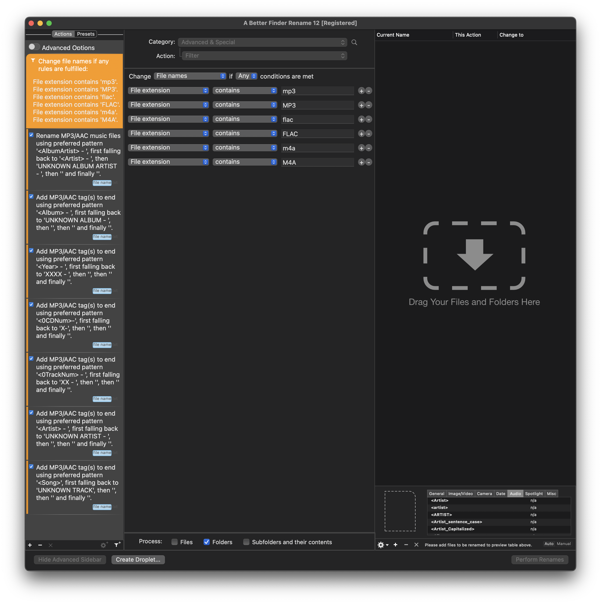
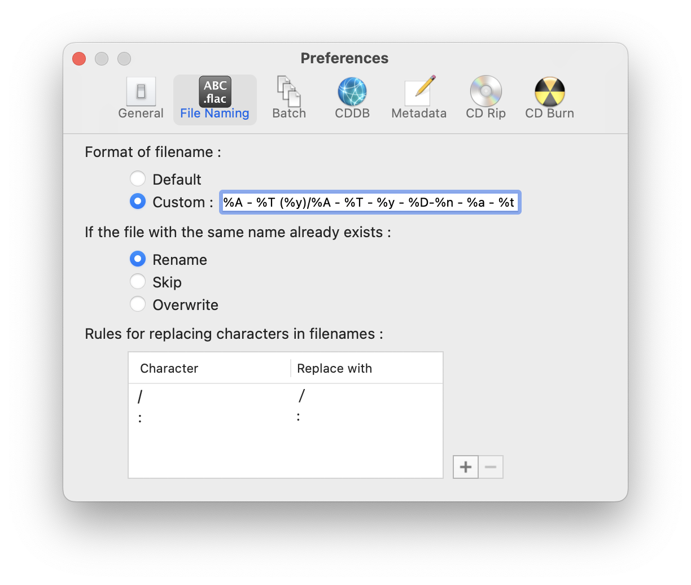
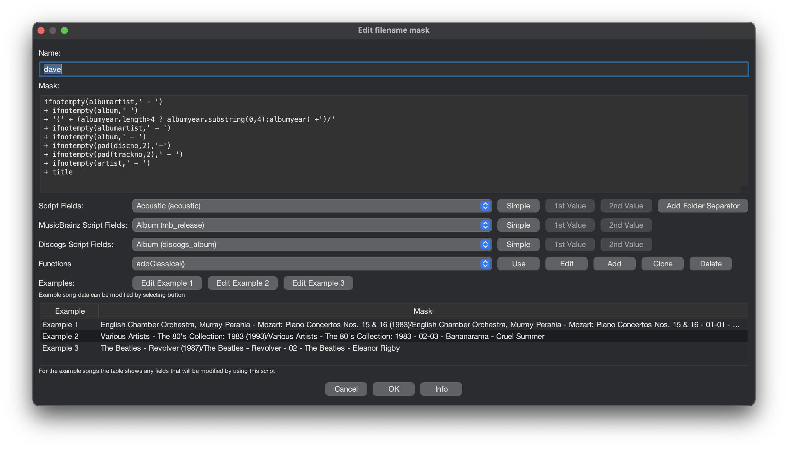
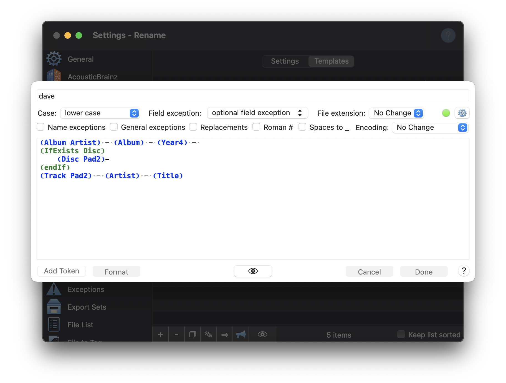

# Commands

<!-- @import "[TOC]" {cmd="toc" depthFrom=1 depthTo=6 orderedList=false} -->

<!-- code_chunk_output -->

- [Commands](#commands)
  - [A Better Finder Rename](#a-better-finder-rename)
  - [XLD](#xld)
  - [Yate](#yate)
  - [Big Mean Folder Machine](#big-mean-folder-machine)
  - [fish](#fish)

<!-- /code_chunk_output -->

## A Better Finder Rename

Pretty sure [A Better Finder Rename][link-abfr] is unused.

The settings are available at [abfr_settings.abfr_preset][link-abfr-settings]



## XLD

Pretty sure [XLD][link-xld] is unused.

```text
%A/%A - %T (%y)/%A - %T - %y - %D-%n - %a - %t
```



## SongKong

```text
ifnotempty3(albumartist,artist,'UNKNOWN ARTIST','') + '/'
+ ifnotempty2(albumartist,'UNKNOWN ALBUM ARTIST','') + ' - '
+ ifnotempty2(album,'UNKNOWN ALBUM','') + ' '
+ '(' + ifnotempty3((albumyear.length>4 ? albumyear.substring(0,4):albumyear),(year.length>4 ? year.substring(0,4):albumyear),'UNKNOWN YEAR','') + ')' + '/'
+ ifnotempty2(albumartist,'UNKNOWN ALBUM ARTIST','') + ' - '
+ ifnotempty2(album,'UNKNOWN ALBUM','') + ' - '
+ ifnotempty2(pad(discno,2),'XX', '') + '-'
+ ifnotempty2(pad(trackno,2),'YY', '') + ' - '
+ ifnotempty2(artist,'UNKNOWN ARTIST','') + ' - '
+ ifnotempty2(title,'UNKNOWN TITLE','')
```



## Yate

Rename with [Yate][link-yate] to

```text
❨Album Artist❩ - ❨Album❩ - ❨Year4❩ -
❨IfExists Disc❩
    ❨Disc Pad2❩-
❨endIf❩
❨Track Pad2❩ - ❨Artist❩ - ❨Title❩
```

Settings are available at [yate_settings.plist][link-yate-settings]



## Big Mean Folder Machine

Flatten with [Big Mean Folder Machine][link-bmfm]

## fish

```fish
find . | \
parallel -j16 \
  "ffmpeg -i {} -ar 44100 -ac 2 -af aresample=osf=s16:rematrix_maxval=1.0:dither_method=improved_e_weighted /Users/dave/Resilio/3.Decimated/{.}.flac"
```

```fish
ffmpeg -i {} \
  -ar 44100 \
  -ac 2 \
  -af aresample=osf=s16:rematrix_maxval=1.0:dither_method=improved_e_weighted \
  ../3.Decimated/{.}.flac
```

```fish
find . | \
cut -b 3- | \
parallel -j16 \
  "if flac -t {} ; echo {}: ok >> log; else; echo {}: failed >> log; end"
```

```fish
if flac -t {}
  echo {}: ok >> ../log
else
  echo {}: failed >> ../log
end
```

[link-bmfm]: https://www.publicspace.net/BigMeanFolderMachine
[link-abfr]: https://www.publicspace.net/ABetterFinderRename
[link-xld]: https://tmkk.undo.jp/xld/index_e.html
[link-yate]: https://2manyrobots.com/yate/
[link-yate-settings]: yate_settings.plist
[link-abfr-settings]: abfr_settings.abfr_preset
