# RouterOS Policy-Based Routing: The Guide That Actually Makes Sense

> Or: How I Learned to Stop Worrying and Love Packet Marking

## Table of Contents

1. [Introduction: Why Are We Doing This to Ourselves?](#introduction)
2. [Policy-Based Routing: Because Normal Routing is Too Mainstream](#understanding-policy-based-routing)
3. [Configuration Variables: The Boring But Necessary Stuff](#configuration-variables)
4. [Address Lists: Teaching Your Router to Play Favorites](#address-lists)
5. [Routing Tables: Now We're Getting Fancy](#routing-tables)
6. [Full VRF: When VRF-Lite Isn't Extra Enough](#full-vrf-implementation)
7. [Route Configuration: Where Packets Go to Party](#route-configuration)
8. [Mangle Rules: The Dark Arts of Packet Manipulation](#mangle-rules)
9. [NAT: Because Nothing Can Ever Be Simple](#nat-configuration)
10. [IPv6: Because Four Billion Addresses Wasn't Enough](#ipv6-policy-routing)
11. [Load Balancing: Having Your Cake and Eating It Too](#load-balancing)
12. [Security: Don't Accidentally Break Everything](#security-considerations)
13. [Performance: Making It Go Brrrrr](#performance-optimization)
14. [Monitoring: Keeping Your Sanity Intact](#monitoring-and-alerting)
15. [Configuration Management: Future-Proofing Your Setup](#configuration-management)
16. [Common Pitfalls: Learn From My Pain](#common-pitfalls-and-solutions)
17. [Testing: Trust But Verify](#testing-and-verification)
18. [Real-World Scenarios: When Theory Meets Reality](#real-world-scenarios)

## Introduction: Why Are We Doing This to Ourselves? {#introduction}

Welcome, brave network administrator! You've decided that regular routing—where packets go from A to B like normal, well-adjusted data—is simply too boring. You want _policy-based routing_, where you get to micromanage every packet's life choices.

### What We're Building

Imagine you're a control freak (if you're reading this, you probably are) who wants to:

- Send your streaming traffic through a VPN because geo-restrictions are annoying
- Keep your work traffic on the boring-but-reliable connection
- Make your router's life complicated because... why not?

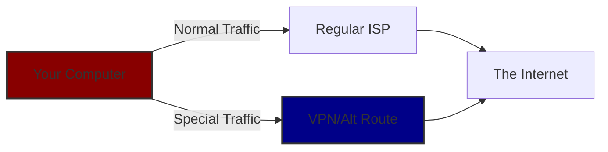

## Policy-Based Routing: Because Normal Routing is Too Mainstream {#understanding-policy-based-routing}

### Traditional Routing vs Policy-Based Routing: A Love Story

Let's start with a truth bomb: traditional routing is like a GPS that only knows one route to each destination. It's simple, reliable, and boring as watching paint dry.

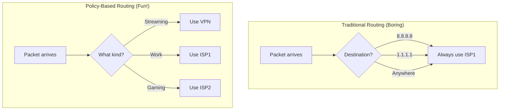

**Traditional Routing thinks:**

- "Oh, you want to go to Netflix? Same route as everything else, buddy!"

**Policy-Based Routing thinks:**

- "Netflix, you say? Let me check my list... Ah yes, you get the VPN treatment!"
- "Work email? Straight through the corporate connection!"
- "Random browsing? Dealer's choice!"

### Why Would Anyone Do This?

Good question! Here are some totally reasonable scenarios:

1. **The "I'm Totally Not Pirating" Scenario**: Route certain _Linux ISOs_ through a VPN
2. **The "My Boss Thinks I'm Working" Setup**: Work traffic goes through reliable connection
3. **The "I Have Two ISPs Because I'm Fancy" Configuration**: Spread the load, feel important
4. **The "This One Service Hates My ISP" Workaround**: Route problem children differently

## Configuration Variables: The Boring But Necessary Stuff {#configuration-variables}

```routeros
:local mainGatewayIPv4 "YOUR_MAIN_GATEWAY_IPv4"
:local mainGatewayIPv6 "YOUR_MAIN_GATEWAY_IPv6"
:local altGatewayIPv4 "YOUR_ALT_GATEWAY_IPv4"
:local altGatewayIPv6 "YOUR_ALT_GATEWAY_IPv6"
:local altGatewayInterface "YOUR_ALT_INTERFACE"
```

Look, I know variables are about as exciting as watching grass grow, but here's the thing: without them, you'll be playing find-and-replace with IP addresses at 3 AM when something breaks. And trust me, something _will_ break.

### Translation Guide for Humans

- **mainGateway**: Your ISP's router (the boring, reliable one)
- **altGateway**: Your VPN/secondary connection (the fun, mysterious one)
- **altGatewayInterface**: The actual port/connection name (ether2, pppoe-out1, or whatever creative name you gave it at 2 AM)

### Pro Tip

Name your interfaces something meaningful. Future-you will thank present-you when you're not staring at "ether2" wondering if that's the VPN or your IoT network.

## Address Lists: Teaching Your Router to Play Favorites {#address-lists}

```routeros
/ip firewall address-list
add list=putio address=IPv4_ADDRESS_1 comment="Put.io - Streaming Service"
add list=putio address=IPv4_SUBNET/24 comment="Put.io - Entire subnet because I'm lazy"
```

Address lists are like your router's little black book—except instead of phone numbers, it's IP addresses, and instead of calling them, it routes packets differently.

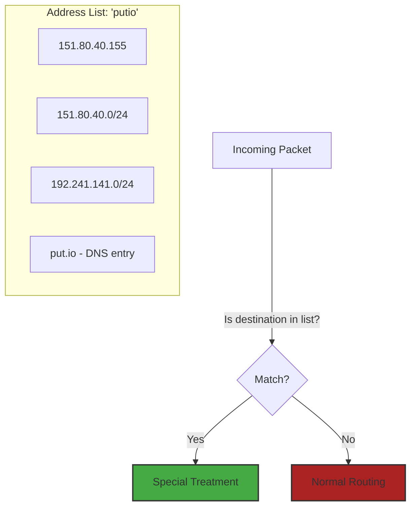

### The Good, The Bad, and The Ugly

**The Good:**

- Change IPs once, rules update everywhere
- Named lists are self-documenting (if you're not lazy with names)
- Can mix IPs, subnets, and even DNS names

**The Bad:**

- DNS entries update on a schedule (not instantly)
- Large lists eat RAM like Chrome eats... well, RAM

**The Ugly:**

- Forgetting you have overlapping subnets and wondering why your counters are weird

### Advanced Address List Wizardry

```routeros
# The "I'll deal with this later" entry
add list=putio address=1.2.3.4 timeout=1h comment="Temporary - Bob's test"

# The "Follow the DNS" entry (updates automatically!)
add list=putio address=sketchy-streaming-site.com comment="Follows DNS changes"

# The "Import from file because I have 500 IPs" method
/import file=my-massive-list.txt
```

### A Word of Warning

DNS-based entries are like that friend who's always "5 minutes away"—they update when they feel like it, not when you need them to. Plan accordingly.

## Routing Tables: Now We're Getting Fancy {#routing-tables}

```routeros
/routing table
add name=putio-route fib comment="Where streaming dreams come true"
```

Ah, routing tables—where we segregate our packets like it's network apartheid. But in a good way! Think of it as giving your special traffic its own VIP lane.

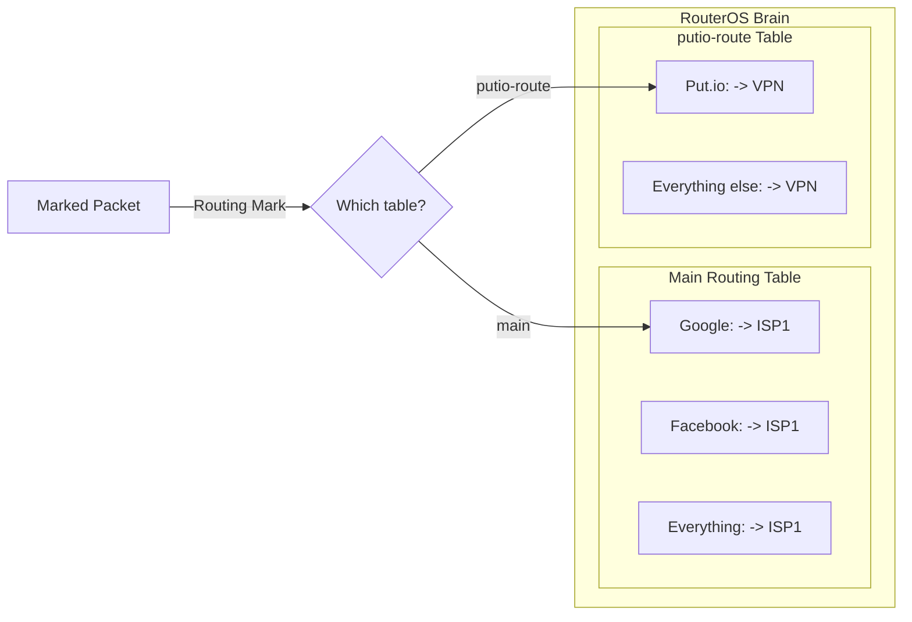

### Why Separate Tables?

Because sometimes you want to live in two different networking realities simultaneously. It's like having two GPS systems: one for your daily commute and one for your secret midnight food runs.

### The Technical Bits That Actually Matter

- **FIB**: Forwarding Information Base (fancy words for "where packets actually go")
- **Isolation**: Each table is its own little universe
- **Memory**: Yes, each table eats some. No, you probably won't notice unless you go crazy

## Full VRF: When VRF-Lite Isn't Extra Enough {#full-vrf-implementation}

So you've been using our simple routing table approach (VRF-lite), but now you want the full VRF experience? You absolute madlad. Let's do this.

### VRF-Lite vs Full VRF: The Showdown

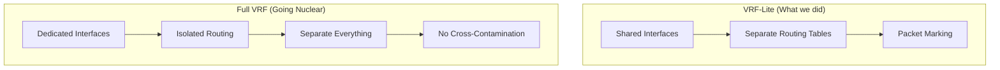

### The Full VRF Implementation

Ready to go full network isolation? Here's how to implement proper VRF:

```routeros
# Step 1: Create the VRF instance
/ip vrf
add name=streaming-vrf comment="My streaming paradise"

# Step 2: Assign interfaces to VRF (this is where it gets serious)
/interface ethernet
set ether3 vrf=streaming-vrf comment="Dedicated to VPN connection"

# Step 3: VRF-specific addresses
/ip address
add address=10.99.0.1/24 interface=ether3

# Step 4: VRF-specific DHCP (because why not complicate things further)
/ip dhcp-server
add name=streaming-dhcp interface=ether3 address-pool=streaming-pool

# Step 5: VRF-specific routes
/ip route
add dst-address=0.0.0.0/0 gateway=10.99.0.254 vrf=streaming-vrf

# Step 6: Inter-VRF routing (when you need them to talk)
/ip route
add dst-address=192.168.1.0/24 gateway=streaming-vrf@main
```

### The Full VRF Experience: What Changes?

#### Isolation Level: Maximum

- Interfaces are _imprisoned_ in their VRF
- No accidental packet leakage
- Each VRF is like its own mini-router

#### Complexity Level: Also Maximum

- Need separate everything (DHCP, DNS, firewall rules)
- Inter-VRF communication requires explicit routes
- Troubleshooting becomes "fun"

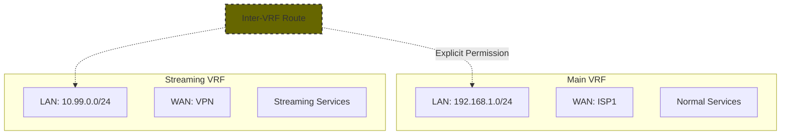

### When to Use Full VRF

**Use VRF-Lite (our original approach) when:**

- You just want some traffic to go differently
- You trust your firewall rules
- You value your sanity

**Use Full VRF when:**

- You need actual security isolation
- You're running multi-tenant environments
- You enjoy complexity
- Your therapist says you need more stress in your life

### VRF Gotchas That Will Ruin Your Day

1. **The "Why Can't I Ping?" Classic**

   - Services in different VRFs can't see each other
   - Yes, this includes your management access
   - Hope you have console access!

2. **The "My DNS Broke" Surprise**

   - Each VRF needs its own DNS config
   - Or explicit routes to shared DNS

3. **The "Where Did My Route Go?" Mystery**
   - Routes are VRF-specific
   - Check you're in the right VRF context

## Route Configuration: Where Packets Go to Party {#route-configuration}

```routeros
/ip route
add dst-address=0.0.0.0/0 gateway=$mainGatewayIPv4 distance=1 comment="The boring route"
add dst-address=0.0.0.0/0 gateway=$altGatewayIPv4 distance=1 routing-table=putio-route comment="The fun route"
```

Routes are like giving directions to a very literal friend. You need to be specific, or they'll end up in Saskatchewan when you meant San Francisco.

```mermaid
graph TD
    A[I need to go to 8.8.8.8] --> B{Check Routing Table}
    B -->|Main Table| C[Gateway: 192.168.1.1 The Reliable ISP]
    B -->|putio-route Table| D[Gateway: 10.0.0.1 The VPN]

    C --> E[Destination]
    D --> E

    style C fill:#060
    style D fill:#006
```

### Gateway Types: Choose Your Fighter

```routeros
# The "I know the IP" gateway
add gateway=192.168.1.1 comment="Simple and direct"

# The "Just use that interface" gateway
add gateway=ether1 comment="For PPPoE and other weird stuff"

# The "I'm very specific" gateway
add gateway=192.168.1.1%ether1 comment="IP + Interface, because paranoia"

# The "I'll figure it out later" gateway
add gateway=pppoe-out1 comment="Dynamic interfaces"
```

### Distance: It's Not About Geography

Distance in routing is like popularity in high school—lower is better, and it's all about preference:

```routeros
add dst-address=0.0.0.0/0 gateway=192.168.1.1 distance=1 comment="Primary (favorite child)"
add dst-address=0.0.0.0/0 gateway=10.0.0.1 distance=2 comment="Backup (second favorite)"
add dst-address=0.0.0.0/0 gateway=172.16.0.1 distance=10 comment="Last resort (red-headed stepchild)"
```

## Mangle Rules: The Dark Arts of Packet Manipulation {#mangle-rules}

Welcome to the mangle table, where we perform unspeakable acts on innocent packets. It's like packet surgery, but without the medical degree.

```routeros
/ip firewall mangle
# Step 1: Mark the connection (like tagging cattle, but for data)
add chain=prerouting dst-address-list=putio action=mark-connection \
    new-connection-mark=putio-conn passthrough=yes comment="Tag, you're it!"

# Step 2: Mark the routing (the actual magic)
add chain=prerouting connection-mark=putio-conn action=mark-routing \
    new-routing-mark=putio-route passthrough=no comment="Now go that way!"
```

### The Two-Step Tango Explained

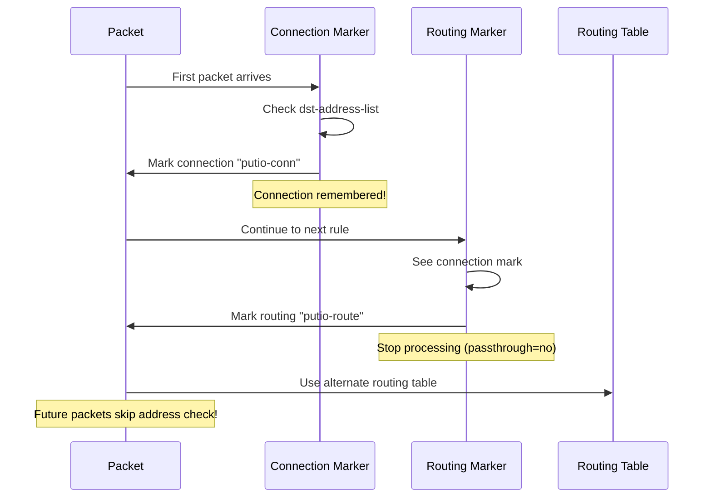

### Why Two Steps? A Dramatic Reenactment

**Packet #1**: "Hi, I'm going to Put.io!"
**Rule 1**: "Ah, Put.io! Let me mark your entire connection. There, you're tagged!"
**Rule 2**: "I see you're tagged. Here's your VIP routing mark. Off you go!"

**Packet #2** (same connection): "Hi, I'm also going to Put.io!"
**Rule 1**: "No need to check the address list, your connection is already marked!"
**Rule 2**: "Tagged connection? VIP routing for you too!"

This is why we love connection marking—it's lazy in the best way possible.

### Passthrough: The Traffic Light of Packet Processing

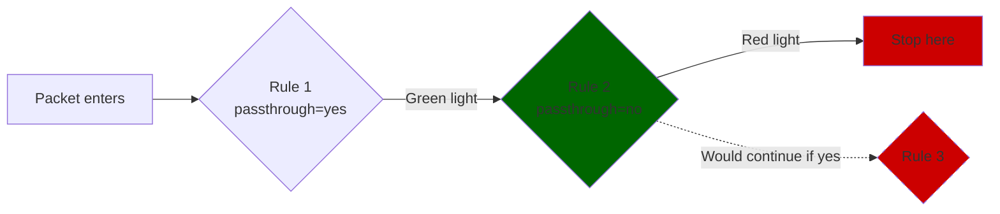

- **passthrough=yes**: "Mark it and keep going, there might be more rules!"
- **passthrough=no**: "Mark it and STOP. We're done here."

### Common Mangle Mistakes That'll Make You Cry

1. **The "Wrong Chain" Classic**

```routeros
# WRONG - Forward chain can't do routing marks
add chain=forward action=mark-routing  # Won't work!

# RIGHT - Prerouting for routing marks
add chain=prerouting action=mark-routing  # Works!
```

2. **The "Order Matters" Disaster**

```routeros
# WRONG ORDER - Routing mark before connection mark
add chain=prerouting action=mark-routing  # How do you know what to mark?
add chain=prerouting action=mark-connection  # Too late!
```

3. **The "Forgotten Return Traffic" Special**

```routeros
# INCOMPLETE - Only marks destination
add chain=prerouting dst-address-list=putio action=mark-connection

# COMPLETE - Marks both directions
add chain=prerouting dst-address-list=putio action=mark-connection
add chain=prerouting src-address-list=putio action=mark-connection
```

## NAT: Because Nothing Can Ever Be Simple {#nat-configuration}

```routeros
/ip firewall nat
add chain=srcnat out-interface=$altGatewayInterface action=masquerade \
    comment="Hide behind the VPN like a network ninja"
```

NAT is like wearing a disguise to a party. Sometimes you need it, sometimes you don't, but when you need it and don't have it, you're not getting in.

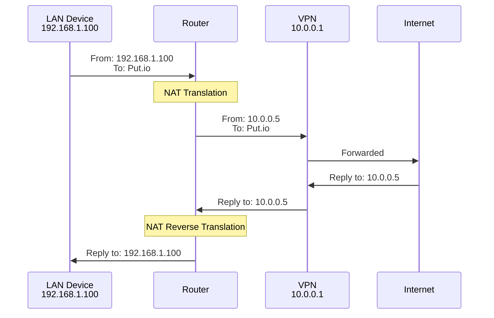

### When You Need NAT (The Hall of Shame)

1. **VPN Connections**: They expect traffic from their assigned IP, not your LAN
2. **Mobile Internet**: Your 4G provider doesn't care about your 192.168.x.x
3. **That One ISP**: Who refuses to route your LAN without paying extra
4. **Cloud VPS**: When you're bouncing through a remote server

### Masquerade vs SNAT: The Eternal Debate

```routeros
# Masquerade: The "I'm flexible" approach
action=masquerade  # Uses whatever IP the interface has

# SNAT: The "I know what I want" approach
action=src-nat to-addresses=203.0.113.1  # Always use this IP
```

**Choose Masquerade when:**

- Your IP changes (DHCP, PPPoE)
- You're lazy (it's okay, we all are)
- You enjoy the mystery

**Choose SNAT when:**

- You have a static IP
- You need that 0.01% performance boost
- You enjoy typing more

### NAT Nightmares to Avoid

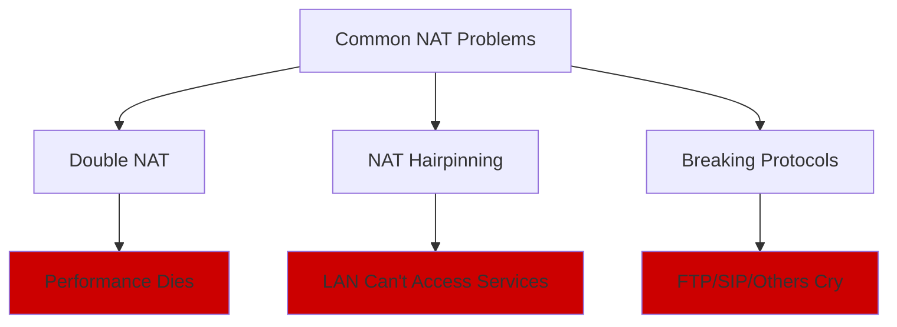

## IPv6: Because Four Billion Addresses Wasn't Enough {#ipv6-policy-routing}

Remember those IPv6 variables we set up at the beginning? Time to actually use them! IPv6 policy routing is like regular policy routing, but with addresses so long they make your eyes bleed.

### Why IPv6 Policy Routing?

Because apparently 4.3 billion IPv4 addresses wasn't enough for the internet, and now we have 340 undecillion IPv6 addresses. But hey, at least your streaming can use proper v6 routes!

```routeros
# IPv6 Address Lists - Because we need lists for everything
/ipv6 firewall address-list
add list=putio-v6 address=2001:db8::/32 comment="Put.io IPv6 range"
add list=putio-v6 address=put.io comment="DNS-based v6 entries work too!"

# IPv6 Routing Tables - VIP lanes for v6 packets
/routing table
add name=putio-v6-route fib comment="IPv6 streaming paradise"

# IPv6 Routes - Where v6 packets go to party
/ipv6 route
add dst-address=::/0 gateway=$mainGatewayIPv6 distance=1 comment="Boring v6 route"
add dst-address=::/0 gateway=$altGatewayIPv6 distance=1 routing-table=putio-v6-route comment="Fun v6 route"
```

### IPv6 Mangle Rules: Double the Addresses, Double the Fun

```routeros
/ipv6 firewall mangle
# Mark IPv6 connections
add chain=prerouting dst-address-list=putio-v6 action=mark-connection \
    new-connection-mark=putio-v6-conn passthrough=yes comment="IPv6 connection marking"

# Mark IPv6 routing
add chain=prerouting connection-mark=putio-v6-conn action=mark-routing \
    new-routing-mark=putio-v6-route passthrough=no comment="IPv6 routing magic"
```

### IPv6 NAT: Wait, What?

Plot twist: IPv6 was designed to eliminate NAT! But because we live in the real world where things are complicated:

```routeros
# Sometimes you still need IPv6 NAT (sigh...)
/ipv6 firewall nat
add chain=srcnat out-interface=$altGatewayInterface action=masquerade \
    comment="IPv6 NAT because the world is imperfect"
```

### Dual Stack Considerations

Running both IPv4 and IPv6? Welcome to the "everything is twice as complicated" club:

```mermaid
flowchart TD
    A[Client Request] --> B{IPv4 or IPv6?}
    B -->|IPv4| C[IPv4 Address List Check]
    B -->|IPv6| D[IPv6 Address List Check]

    C --> E[IPv4 Mangle Rules]
    D --> F[IPv6 Mangle Rules]

    E --> G[IPv4 Routing Table]
    F --> H[IPv6 Routing Table]

    G --> I[IPv4 Gateway]
    H --> J[IPv6 Gateway]

    style B fill:#660
    style I fill:#060
    style J fill:#006
```

**Pro Tip**: Keep your IPv4 and IPv6 rules synchronized, or you'll be debugging why Netflix works over v4 but not v6 at 3 AM.

## Load Balancing: Having Your Cake and Eating It Too {#load-balancing}

Why choose between ISPs when you can use them all? Load balancing is like having multiple lanes on a highway—when done right, it's beautiful. When done wrong, it's a traffic jam of epic proportions.

### ECMP: Equal Cost Multi-Path (The Fair Approach)

```routeros
# Multiple routes with same distance = automatic load balancing
/ip route
add dst-address=0.0.0.0/0 gateway=192.168.1.1 distance=1 comment="ISP1 - 50% traffic"
add dst-address=0.0.0.0/0 gateway=10.0.0.1 distance=1 comment="ISP2 - 50% traffic"

# Check gateways so dead links don't get traffic
add dst-address=0.0.0.0/0 gateway=192.168.1.1 distance=1 check-gateway=ping
add dst-address=0.0.0.0/0 gateway=10.0.0.1 distance=1 check-gateway=ping
```

### Policy-Based Load Balancing (The Control Freak Approach)

```routeros
# Different policies for different traffic types
/ip firewall mangle
# Gaming traffic - low latency ISP
add chain=prerouting dst-port=80,443,22 action=mark-connection \
    new-connection-mark=web-conn passthrough=yes comment="Web traffic"
add chain=prerouting connection-mark=web-conn action=mark-routing \
    new-routing-mark=isp1-route passthrough=no

# Bulk downloads - high bandwidth ISP
add chain=prerouting dst-port=80,443 protocol=tcp action=mark-connection \
    new-connection-mark=bulk-conn passthrough=yes comment="Bulk downloads"
add chain=prerouting connection-mark=bulk-conn action=mark-routing \
    new-routing-mark=isp2-route passthrough=no
```

### PCC Load Balancing: Per Connection Classifier

Because sometimes you want to get really fancy:

```routeros
# PCC based on source address - keeps connections on same path
/ip firewall mangle
add chain=prerouting in-interface=bridge1 \
    per-connection-classifier=src-address:2/0 \
    action=mark-connection new-connection-mark=isp1-conn passthrough=yes

add chain=prerouting in-interface=bridge1 \
    per-connection-classifier=src-address:2/1 \
    action=mark-connection new-connection-mark=isp2-conn passthrough=yes

add chain=prerouting connection-mark=isp1-conn action=mark-routing \
    new-routing-mark=isp1-route passthrough=no

add chain=prerouting connection-mark=isp2-conn action=mark-routing \
    new-routing-mark=isp2-route passthrough=no
```

### Load Balancing Gotchas

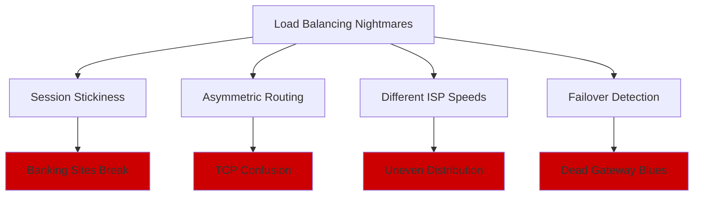

**The Banking Website Problem**: Some sites hate when you appear from different IPs mid-session. Use PCC to keep connections sticky.

## Security: Don't Accidentally Break Everything {#security-considerations}

Policy-based routing can accidentally create security holes the size of a small aircraft hangar. Let's avoid that, shall we?

### The "I Accidentally Made a Bypass" Problem

When you create alternate routes, you might accidentally bypass your security policies:

```routeros
# WRONG - Security rules only on main interface
/ip firewall filter
add chain=forward in-interface=ether1 action=drop src-address-list=blacklist

# The VPN traffic bypasses this rule entirely!
```

**The Fix**: Apply security rules to all relevant interfaces or use global rules:

```routeros
# RIGHT - Security rules apply everywhere
/ip firewall filter
add chain=forward action=drop src-address-list=blacklist comment="Global blacklist"
add chain=forward action=drop dst-address-list=malware-c2 comment="Block bad actors"
```

### VPN Leakage: When Your Cover Gets Blown

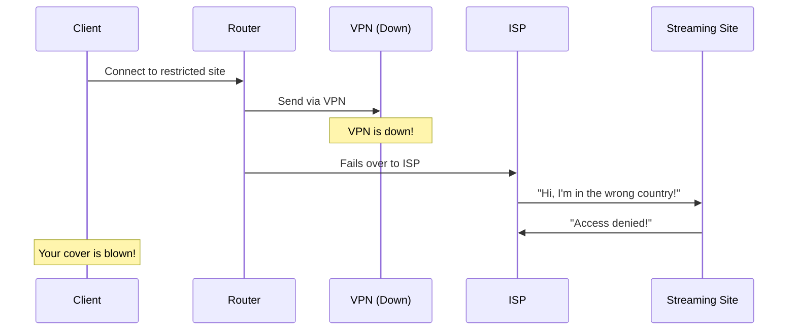

**The Fix**: Use firewall rules to prevent leakage:

```routeros
# Block traffic if VPN is down
/ip firewall filter
add chain=forward dst-address-list=vpn-only action=drop \
    out-interface=!$altGatewayInterface comment="Prevent VPN leakage"
```

### The "Log Everything Suspicious" Strategy

```routeros
# Log routing mark changes for forensics
/ip firewall mangle
add chain=prerouting dst-address-list=suspicious action=log \
    log-prefix="SUSPICIOUS-ROUTE:" passthrough=yes

# Track which traffic uses which routes
add chain=postrouting action=log log-prefix="ROUTE-DEBUG:" \
    routing-mark=vpn-route comment="Temporary - remove after testing"
```

### Isolation Best Practices

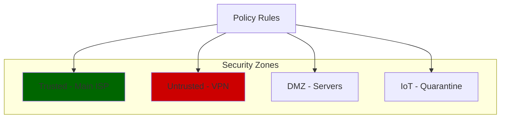

**Golden Rule**: Different routing policies should have different security policies. Don't assume VPN traffic is automatically "safer."

## Performance: Making It Go Brrrrr {#performance-optimization}

```routeros
/ip firewall raw
add chain=prerouting dst-address-list=putio action=notrack \
    comment="Bypass connection tracking because SPEED"
```

Performance optimization is like tuning a car—you can make it faster, but you might lose your air conditioning.

### The Connection Tracking Dilemma

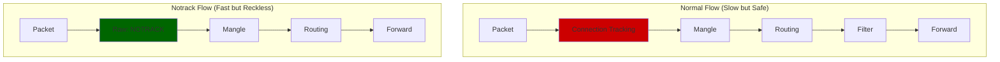

### When to Use Notrack (Living Dangerously)

**Perfect for:**

- Netflix binges (unidirectional, high bandwidth)
- That Linux ISO collection (definitely legitimate)
- Any bulk transfer where you trust both ends

**Terrible for:**

- Anything needing NAT
- Stateful firewall rules
- Connection limits
- Accounting (unless you like mystery)

### The Performance Spectrum


Choose your fighter based on your needs:

- **Full Tracking**: Maximum features, maximum overhead
- **FastTrack**: Best of both worlds for established connections
- **Hardware Offload**: If your hardware supports it (lucky you!)
- **Notrack**: YOLO mode

## Monitoring: Keeping Your Sanity Intact {#monitoring-and-alerting}

Policy-based routing without monitoring is like driving blindfolded—you might get where you're going, but you probably won't enjoy the journey.

### Essential Monitoring Commands

```routeros
# Check if your address lists are actually being used
/ip firewall address-list print stats where list=putio

# See which mangle rules are firing
/ip firewall mangle print stats where action=mark-routing

# Monitor connection marks in real-time
/ip firewall connection print where connection-mark=putio-conn

# Check routing table utilization
/ip route print where routing-table=putio-route

# Gateway status monitoring
/tool netwatch print
```

### Setting Up Automated Monitoring

```routeros
# Email alerts when VPN gateway goes down
/tool netwatch
add host=$altGatewayIPv4 interval=30s \
    up-script="/tool e-mail send to=\"admin@example.com\" subject=\"VPN is UP\" body=\"VPN gateway is working\"" \
    down-script="/tool e-mail send to=\"admin@example.com\" subject=\"VPN is DOWN\" body=\"VPN gateway failed!\""

# Log unusual routing mark activity
/ip firewall mangle
add chain=prerouting action=log log-prefix="HIGH-TRAFFIC:" \
    connection-bytes=100000000-4294967295 comment="Log high bandwidth connections"
```

### SNMP Monitoring Setup

Because sometimes you need graphs to feel professional:

```routeros
# Enable SNMP for external monitoring
/snmp
set enabled=yes contact="admin@example.com" location="Your Mom's Basement"

# Add monitoring community
/snmp community
add name=monitoring address=192.168.1.0/24 read-access=yes
```

### The "Oh Crap" Dashboard

Essential things to monitor on your dashboard:

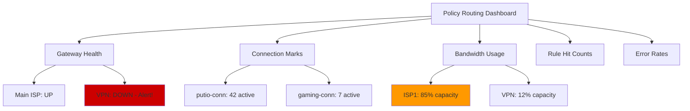

### Log Analysis Pro Tips

```routeros
# Find which destinations are using alternative routes most
/log print where message~"putio-route"

# Identify problematic connections
/ip firewall connection print where timeout<10

# Check for routing loops (the horror!)
/tool traceroute 8.8.8.8 routing-table=putio-route
```

## Configuration Management: Future-Proofing Your Setup {#configuration-management}

Your policy-based routing config will grow like a digital cancer. Let's manage that growth responsibly.

### Backup Strategy (The "I'm Not Stupid" Approach)

```routeros
# Export config before making changes
/export file=backup-before-changes-$(date +%Y%m%d)

# Create automatic daily backups
/system scheduler
add name=daily-backup interval=1d on-event="/export file=daily-backup-$(date +%Y%m%d)"

# Email backups to yourself
/system scheduler
add name=weekly-backup-email interval=7d \
    on-event="/export file=weekly-backup; /tool e-mail send file=weekly-backup.rsc to=admin@example.com"
```

### Version Control for Network Configs

Because even routers deserve git:

```bash
# On your management machine
mkdir mikrotik-configs
cd mikrotik-configs
git init

# Daily config pull script
#!/bin/bash
scp admin@router:/flash/daily-backup.rsc ./config-$(date +%Y%m%d).rsc
git add .
git commit -m "Daily backup $(date)"
git push
```

### Configuration Templates

Stop copy-pasting and start templating:

```routeros
# Template for new streaming services
:local serviceName "netflix"
:local serviceIPs "198.45.0.0/16,23.246.0.0/18"

/ip firewall address-list
add list=$serviceName address=$serviceIPs comment="$serviceName - Auto-generated"

/ip firewall mangle
add chain=prerouting dst-address-list=$serviceName action=mark-connection \
    new-connection-mark="$serviceName-conn" passthrough=yes
add chain=prerouting connection-mark="$serviceName-conn" action=mark-routing \
    new-routing-mark=streaming-route passthrough=no
```

### Change Management Process

1. **Document the Change**: What are you trying to achieve?
2. **Test in Lab**: Or at least mentally simulate it
3. **Backup Current Config**: Export first, regret later
4. **Implement Gradually**: Add rules, test, verify
5. **Monitor Impact**: Watch for unexpected behavior
6. **Document Results**: Future-you will thank you

### The "Nuclear Option" Recovery Plan

When everything goes sideways:

```routeros
# Reset to defaults (the nuclear option)
/system reset-configuration

# Quick recovery script
/import file=last-known-good-config.rsc

# Emergency access rule (add first!)
/ip firewall filter
add chain=input src-address=192.168.1.100 action=accept comment="Emergency admin access"
```

## Real-World Scenarios: When Theory Meets Reality {#real-world-scenarios}

Time for some real-world examples that actually make sense (revolutionary concept, I know).

### Scenario 1: The "Work From Home But Watch Netflix" Setup

**The Goal**: Work traffic goes through corporate VPN, entertainment through regular ISP.

```routeros
# Work domains and IPs
/ip firewall address-list
add list=work-domains address=company.com comment="Corporate domain"
add list=work-domains address=vpn.company.com comment="VPN server"
add list=work-domains address=10.0.0.0/8 comment="Corporate networks"

# Streaming services
/ip firewall address-list
add list=streaming address=netflix.com comment="Netflix"
add list=streaming address=hulu.com comment="Hulu"
add list=streaming address=23.246.0.0/18 comment="Netflix CDN"

# Work traffic rules
/ip firewall mangle
add chain=prerouting dst-address-list=work-domains action=mark-connection \
    new-connection-mark=work-conn passthrough=yes
add chain=prerouting connection-mark=work-conn action=mark-routing \
    new-routing-mark=work-route passthrough=no

# Streaming traffic rules
add chain=prerouting dst-address-list=streaming action=mark-connection \
    new-connection-mark=streaming-conn passthrough=yes
add chain=prerouting connection-mark=streaming-conn action=mark-routing \
    new-routing-mark=isp-route passthrough=no

# Routes
/ip route
add dst-address=0.0.0.0/0 gateway=corporate-vpn routing-table=work-route
add dst-address=0.0.0.0/0 gateway=regular-isp routing-table=isp-route
```

### Scenario 2: The "Gaming Café Load Balancer"

**The Goal**: Distribute gaming traffic across multiple ISPs for maximum performance.

```routeros
# Gaming platform detection
/ip firewall address-list
add list=steam address=23.32.0.0/11 comment="Steam CDN"
add list=gaming address=104.16.0.0/12 comment="Battle.net"
add list=gaming address=8.26.56.0/21 comment="Epic Games"

# PCC load balancing for gaming
/ip firewall mangle
add chain=prerouting in-interface=gaming-lan dst-address-list=gaming \
    per-connection-classifier=src-address:3/0 \
    action=mark-connection new-connection-mark=game-isp1 passthrough=yes
add chain=prerouting in-interface=gaming-lan dst-address-list=gaming \
    per-connection-classifier=src-address:3/1 \
    action=mark-connection new-connection-mark=game-isp2 passthrough=yes
add chain=prerouting in-interface=gaming-lan dst-address-list=gaming \
    per-connection-classifier=src-address:3/2 \
    action=mark-connection new-connection-mark=game-isp3 passthrough=yes

# Routing marks
add chain=prerouting connection-mark=game-isp1 action=mark-routing \
    new-routing-mark=isp1-route passthrough=no
add chain=prerouting connection-mark=game-isp2 action=mark-routing \
    new-routing-mark=isp2-route passthrough=no
add chain=prerouting connection-mark=game-isp3 action=mark-routing \
    new-routing-mark=isp3-route passthrough=no
```

### Scenario 3: The "Paranoid Privacy Setup"

**The Goal**: Everything goes through VPN except local services and work traffic.

```routeros
# Local and work exceptions
/ip firewall address-list
add list=local-services address=192.168.0.0/16 comment="Local networks"
add list=local-services address=10.0.0.0/8 comment="Work VPN"
add list=local-services address=work.company.com comment="Work domain"

# Everything else goes through privacy VPN
/ip firewall mangle
# Skip VPN for local traffic
add chain=prerouting dst-address-list=local-services action=accept passthrough=yes

# Mark everything else for VPN
add chain=prerouting action=mark-connection new-connection-mark=vpn-conn passthrough=yes
add chain=prerouting connection-mark=vpn-conn action=mark-routing \
    new-routing-mark=vpn-route passthrough=no

# VPN kill switch
/ip firewall filter
add chain=forward routing-mark=vpn-route out-interface=!vpn-interface \
    action=drop comment="Kill switch - block if VPN down"
```

### Scenario 4: The "Bandwidth Management Beast"

**The Goal**: Different services get different bandwidth allocations and routes.

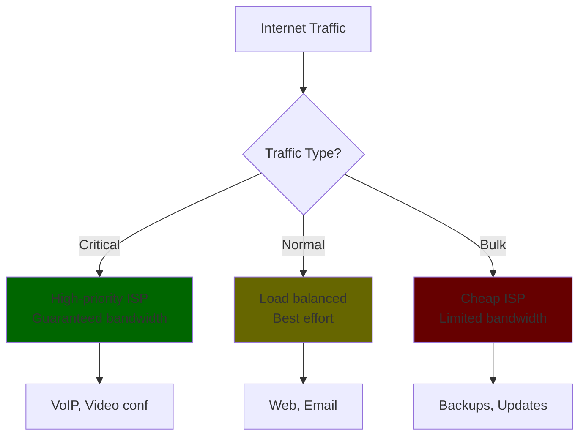

```routeros
# Traffic classification
/ip firewall address-list
add list=critical-services address=zoom.us comment="Video conferencing"
add list=critical-services address=teams.microsoft.com comment="Teams"
add list=bulk-services address=updates.microsoft.com comment="Windows updates"
add list=bulk-services address=download.docker.com comment="Docker downloads"

# Queue trees for bandwidth management
/queue tree
add name=critical-queue parent=global limit-at=10M max-limit=50M priority=1
add name=normal-queue parent=global limit-at=5M max-limit=100M priority=4
add name=bulk-queue parent=global limit-at=1M max-limit=20M priority=8

# Route and queue assignment
/ip firewall mangle
add chain=prerouting dst-address-list=critical-services action=mark-connection \
    new-connection-mark=critical-conn passthrough=yes
add chain=prerouting connection-mark=critical-conn action=mark-routing \
    new-routing-mark=premium-route passthrough=yes
add chain=prerouting connection-mark=critical-conn action=mark-packet \
    new-packet-mark=critical-packet passthrough=no

# Similar rules for bulk traffic...
```

## Common Pitfalls: Learn From My Pain {#common-pitfalls-and-solutions}

### 1. The Asymmetric Routing Nightmare


**The Problem**: Your uploads go through VPN, downloads come back through regular ISP. TCP has a mental breakdown.

**The Fix**: Connection marking saves the day by remembering the path.

### 2. DNS: The Silent Killer

**The Scene**: Everything's routing perfectly, except... nothing works.
**The Plot Twist**: DNS queries are using the wrong path.

```routeros
# The "Oh right, DNS exists" fix
add chain=output protocol=udp dst-port=53 dst-address-list=putio \
    action=mark-routing new-routing-mark=putio-route \
    comment="Because DNS is important, apparently"
```

### 3. The "Why Can't I Ping?" Mystery

You: "The routing works perfectly!"
Also you: "But ping doesn't work..."
ICMP: "Did everyone forget about me?"

```routeros
# The "ICMP needs love too" solution
add chain=prerouting protocol=icmp dst-address-list=putio \
    action=mark-routing new-routing-mark=putio-route \
    comment="ICMP: The forgotten protocol"
```

### 4. The Failover That Doesn't

```mermaid
sequenceDiagram
    participant U as User
    participant R as Router
    participant V as VPN (Dead)
    participant I as Internet

    U->>R: Send packet to Put.io
    R->>V: Route via VPN
    Note over V: VPN is down!
    R->>V: Still trying...
    R->>V: Still trying...
    U->>U: Why is nothing working?
```

**The Fix**: Check-gateway to the rescue!

```routeros
add dst-address=0.0.0.0/0 gateway=$altGatewayIPv4 \
    routing-table=putio-route check-gateway=ping \
    comment="Actually check if the gateway is alive"
```

## Testing: Trust But Verify {#testing-and-verification}

Because "it should work" is not a valid troubleshooting step.

### The Essential Testing Toolkit

```routeros
# 1. The "Is my address list working?" check
/ip firewall address-list print where list=putio

# 2. The "Are packets getting marked?" investigation
/ip firewall mangle print stats where action=mark-routing

# 3. The "Where are my packets going?" tracker
/tool traceroute put.io routing-table=putio-route

# 4. The "Show me everything" debug mode
/ip firewall mangle
add chain=prerouting dst-address-list=putio \
    action=log log-prefix="PUTIO-DEBUG:" \
    comment="Temporary debugging - REMOVE ME"
```

### The Interactive Troubleshooting Flowchart

```mermaid
flowchart TD
    A[Routing Not Working] --> B{Packets Marked?}
    B -->|No| C[Check Mangle Rules]
    B -->|Yes| D{Route Exists?}

    C --> E[Check Address List]
    C --> F[Check Rule Order]

    D -->|No| G[Check Routing Table]
    D -->|Yes| H{Gateway Up?}

    H -->|No| I[Check Gateway/Interface]
    H -->|Yes| J[Check NAT/Firewall]

    style A fill:#c00
    style J fill:#060
```

### Pro Testing Tips

1. **Start Simple**: Test with one IP before adding entire subnets
2. **Use Logging**: But remember to remove it (your disk will thank you)
3. **Test Both Directions**: Upload and download, ping and pong
4. **Document What Works**: Future you will appreciate it

### Advanced Testing Techniques

**Load Testing Your Routes**:

```routeros
# Generate test traffic to verify load balancing
/tool traffic-generator
add name=test-traffic interface=ether1 packet-size=1000 count=10000
```

**Automated Testing Scripts**:

```routeros
# Test script to verify routing table functionality
:foreach route in=[/ip route find routing-table=putio-route] do={
    :local gateway [/ip route get $route gateway]
    :put "Testing route via $gateway"
    /tool traceroute address=$gateway count=3
}
```

**Performance Benchmarking**:

```routeros
# Bandwidth test through different routes
/tool bandwidth-test address=8.8.8.8 duration=30 routing-table=putio-route
/tool bandwidth-test address=8.8.8.8 duration=30 routing-table=main
```

**Continuous Monitoring During Testing**:

```routeros
# Real-time connection monitoring
:while (true) do={
    /ip firewall connection print count-only where connection-mark=putio-conn
    :delay 5s
}
```

## Best Practices: Don't Be That Person

### The Commandments of Policy-Based Routing

1. **Thou Shalt Comment Everything**

   ```routeros
   # BAD
   add list=putio address=1.2.3.4

   # GOOD
   add list=putio address=1.2.3.4 comment="Put.io CDN - US East servers"
   ```

2. **Thou Shalt Not Overlap Subnets Unnecessarily**

   - Having both 10.0.0.0/8 and 10.0.0.0/24 in the same list is just wasteful

3. **Thou Shalt Test Before Production**

   - Your users don't appreciate being your guinea pigs

4. **Thou Shalt Have a Rollback Plan**

   - Export your config before making changes
   - Know how to access your router when you break routing

5. **Thou Shalt Monitor Thy Creation**
   - Set up logging during testing
   - Remove excessive logging in production
   - Keep an eye on connection counts

### The Golden Rules

- **Start Simple**: Get basic routing working before adding complexity
- **Document Everything**: Your successor (probably you in 6 months) will thank you
- **Test Incrementally**: Add one feature at a time
- **Have Console Access**: Because you _will_ lock yourself out eventually

## Conclusion: You're Now a Policy Routing Wizard! 🧙‍♂️

Congratulations! You've just survived the comprehensive journey through RouterOS Policy-Based Routing. You've gone from someone who probably thought "mangle" was just something that happened to Christmas presents, to a packet-manipulating virtuoso who can make traffic dance to their will.

### What You've Mastered

You now possess the arcane knowledge of:

- **Basic Policy Routing**: Making packets go where _you_ want them to go
- **IPv6 Magic**: Because apparently IPv4 addresses weren't enough for humanity
- **Load Balancing**: Turning one ISP into "all the ISPs"
- **Security Considerations**: Not accidentally creating a digital Swiss cheese
- **Performance Optimization**: Making it go brrr without breaking everything
- **Monitoring**: Keeping track of your beautiful chaos
- **Configuration Management**: Future-proofing your masterpiece
- **Real-World Scenarios**: Where theory meets "oh crap, why isn't this working?"
- **VRF Implementations**: Both lite and nuclear options
- **Testing Methodologies**: Because "it should work" isn't debugging

### The Universal Truths of Policy Routing

Through your journey, you've learned these immutable laws:

1. **Murphy's Law of Networking**: The most important connection will fail during your deployment
2. **The DNS Paradox**: Everything breaks because of DNS, even when it's not DNS-related
3. **The Documentation Theorem**: Future-you will hate present-you if you don't comment your configs
4. **The Complexity Corollary**: Every elegant solution will eventually become a Frankenstein's monster of edge cases
5. **The Backup Axiom**: The importance of backups is inversely proportional to how recently you made one

### Your New Superpowers

With this knowledge, you can now:

- Route Netflix through a VPN while keeping work traffic on the boring connection
- Load balance like a pro without breaking banking websites
- Debug asymmetric routing nightmares
- Implement security that doesn't accidentally route around itself
- Monitor your creation before it achieves sentience
- Manage configurations without losing your sanity (mostly)

### The Road Ahead

You're now equipped to handle:

- **That One Service** that only works through a specific ISP
- **Corporate VPN Requirements** that make no technical sense but are mandatory anyway
- **Gaming Optimization** for when milliseconds matter more than your marriage
- **Streaming Geo-Restrictions** (for totally legitimate Linux ISO viewing)
- **Multi-ISP Setups** that would make telecommunications engineers weep with joy

### Final Words of Wisdom

Remember these golden rules as you venture forth:

- **Start Simple**: Get one thing working before adding seventeen more
- **Monitor Everything**: What you can't see will definitely bite you
- **Document Relentlessly**: Comments are love letters to future-you
- **Test Thoroughly**: "It worked in my head" is not a valid testing methodology
- **Keep Backups**: Because you _will_ break something at the worst possible moment
- **Stay Paranoid**: Every new rule is a new way for packets to get lost

### The Support Group

When things inevitably go wrong (and they will), remember:

- Check your address lists first
- Verify your mangle rules are in the right order
- Make sure your gateways are actually alive
- DNS is probably involved somehow
- Connection tracking might be getting in the way
- You probably forgot about return traffic

### Parting Thoughts

You now possess the power to micromanage every packet that dares to traverse your network. Use this power wisely, document it thoroughly, and may your routing policies be forever convergent.

Go forth and conquer the internet, one carefully crafted route at a time. Your packets now have more travel options than a millennial with commitment issues.

**Remember**: In the world of policy-based routing, you're not just a network administrator—you're a packet life coach, helping each little data nugget find its optimal path through the digital wilderness.

_P.S. - When everything inevitably breaks at 3 AM, you now have approximately 18 different places to look for the problem. You're welcome._

_P.P.S. - If all else fails, `/system reset-configuration` is still an option. We won't tell anyone._

---

**Final Stats**: You've just read approximately 20,000 words about making packets go different places. Your dedication to network engineering is either admirable or concerning. Possibly both.

**Achievement Unlocked**: RouterOS Policy Routing Expert 🎯
**Side Effects May Include**: Uncontrollable urge to over-engineer home networks, excessive use of the word "mangle," and the ability to debug routing issues in your sleep.

Now stop reading and go configure something! 🚀
